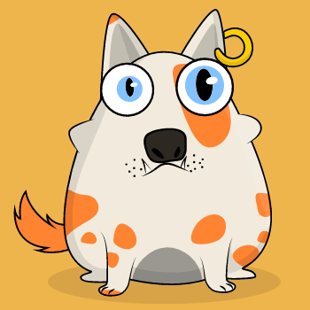
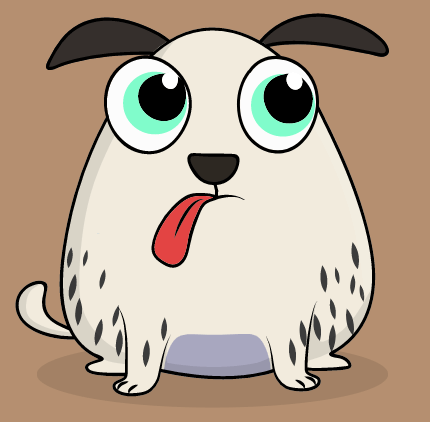

# Pet chain of React Component

# [![NPM version][npm-image]][npm-url]

## Example

```jsx
import { Pet } from '@zswang/react-petchain';

let props = {
  bgColor: '日落黄',
  body: '灰太狼',
  bodyColor: '牙黄',
  eye: '小惊讶',
  eyeColors: '浅钴蓝',
  pattern: '奶牛',
  patternColor: '变异橙',
  bellyColor: '深灰',
  mouth: '小獠牙',
};

const pet = <Pet {...props} />;
```

## Screenshot




## License

MIT © [zswang](http://weibo.com/zswang)

[npm-url]: https://npmjs.org/package/@zswang/react-petchain
[npm-image]: https://badge.fury.io/js/@zswang/react-petchain.svg
